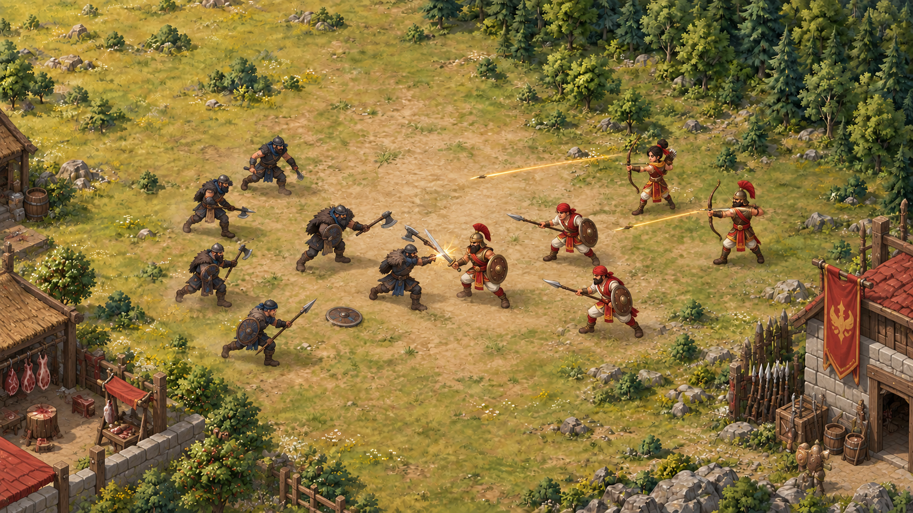

# Combat in the lower clearing

This image is a composition study, not a replacement terrain or a finished game frame. It enlarges fighters to show the intended poses. Runtime combat should keep the current full-city camera and current character scale.

## Stage

- Fight in the open lower-center ground between Butchery (plan point 441, 820) and Barracks (1693, 820). Keep the central clash around plan x 950–1130, y 760–870, clear of building footprints and roads.
- Show 5–10 defenders from the Barracks side and 5–10 raiders from the Butchery side. If the final army contains more soldiers, show a representative squad while the report counts the full force.
- Put melee fighters in two loose front ranks. Keep archers behind them so arrows and targets read clearly at small size. Give each unit a slight y offset so sprites do not form a flat line.
- No camera zoom: the user should still see the whole city. Hide the build-choice panel during combat; show the final army report after the action settles.

## Animation beats

| Beat | Approximate time | Visual motion |
| --- | --- | --- |
| Alarm | 1.5 s | Barracks banner flicks, defenders turn toward incoming raiders, a small dust trail appears at the west edge. |
| Approach | 2–3 s | Both ranks use their existing four-frame walk cycles and slow as they reach their opponents. Archers stop behind the front line. |
| First volley | 1 s | Archers draw, loose two staggered arrows, and show narrow trails. A shield block answers one arrow. |
| Melee exchange | 8–12 s | Paired fighters alternate windup, strike, impact, and recovery. Add one compact spark or dust puff at each contact; a brief recoil and a half-step back sell the hit. |
| Outcome | 2–3 s | Losing fighters kneel/fall and fade or withdraw. Victors raise weapons briefly, then return to idle while the army report appears. |

Avoid one large synchronized hit. Offset attacks by 0.2–0.5 seconds, limit simultaneous impact effects to two, and keep silhouettes distinct. Use sword swishes, shield blocks, dust at feet, and tiny screen-space flashes rather than blood or dense particles.

## Art assets to make

Keep the current 512 × 512 PNG convention: four 256 × 256 transparent poses in a 2 × 2 sheet. Reuse the existing `-walk4.png` sheets for approach and retreat.

1. **Defender melee attack sheets:** swordsman, spearman, militia. Frames: ready → windup → contact → recover.
2. **Defender archer attack sheet:** aim → full draw → release → reload. Animate the arrow separately so its flight is readable.
3. **Raider characters:** axe raider, shield raider, and ranged raider, each with walk and attack sheets. Variants can be tinted and equipped differently to fill a 5–10 unit force without ten unique rigs.
4. **Shared reactions:** two-frame flinch/block and a short kneel/fall or retreat sequence. Reuse across compatible characters.
5. **Separate effects:** small impact spark, dry-ground dust puff, sword arc, arrow with short trail, and a banner flutter. Effects can scale independently of character art.

The first playable slice should use five defenders and five raiders, then grow to ten per side once spacing and timing read well at the game's smallest viewport.
