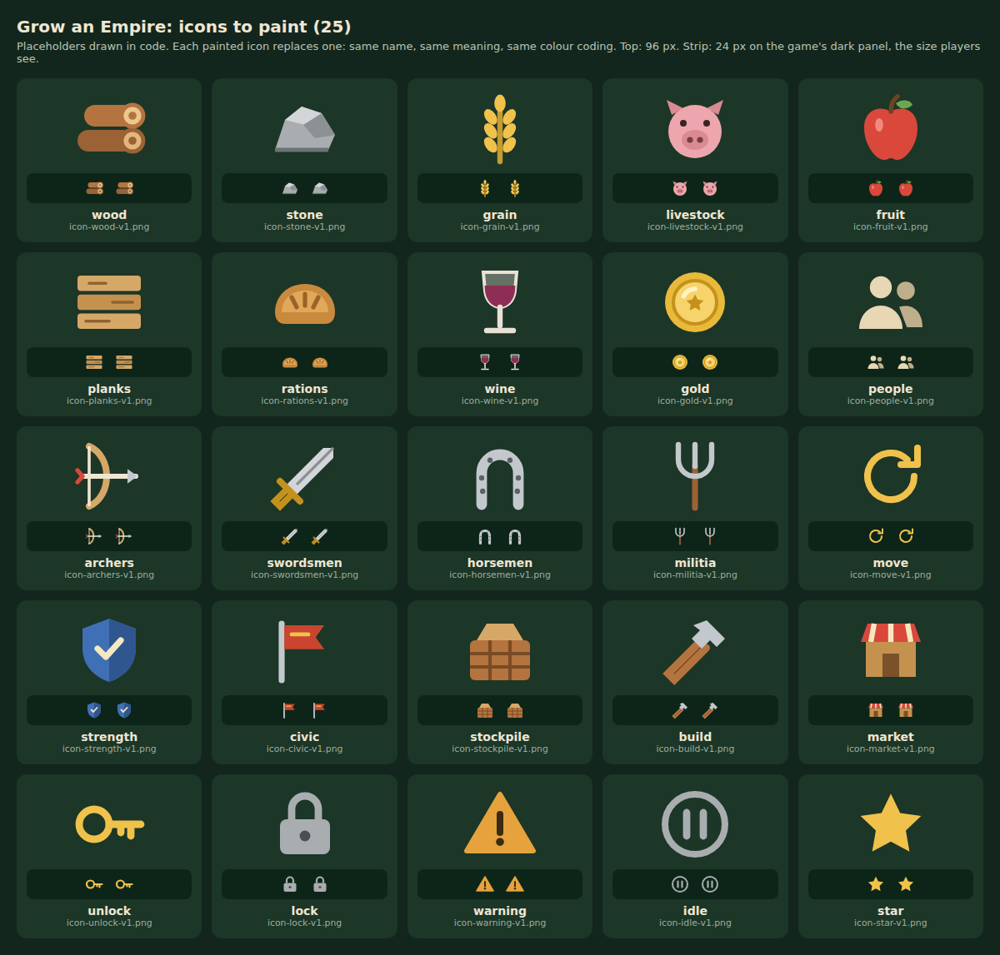

# Painted icon commission brief

Grow an Empire is a painted, top-down city builder for phones and desktop browsers. Since v0.4.0 the game shows almost every number as an icon plus a number ("+5 [log]"). The icons are drawn in code for now (`Docs/art/icon-commission-sheet.png`). This brief commissions painted versions that match the building art.

## What to paint: 25 icons

| Group | Icons (file name `icon-<name>-v1.png`) | Notes |
|---|---|---|
| Goods (9) | wood, stone, grain, livestock, fruit, planks, rations, wine, gold | Keep the colour coding: wood warm brown, stone cool grey, grain gold, livestock pink, fruit red, planks pale tan, rations baked orange, wine deep purple, gold yellow |
| Soldiers and people (5) | people, archers, swordsmen, horsemen, militia | An object, not a figure: bow, sword, horseshoe, pitchfork. People = two villagers' heads and shoulders |
| City and rules (11) | move, strength, civic, stockpile, build, market, unlock, lock, warning, idle, star | move = the turn of a move (a circular arrow); strength = a blue shield; civic = the town banner; stockpile = a crate; build = a hammer; idle = a paused workshop |

## Style

- Painted to match the buildings and characters (`Assets/Art/Production/Buildings/*/Runtime2x/*-level-1-2x-v1.png`): warm daylight from the top left, soft painted edges, gentle ambient occlusion, a slight top-down three-quarter view.
- One object per icon, no text, no frame or background plate, no drop shadow beyond a soft contact shadow.
- **Readable at 20–24 px on a dark green panel (#13261d).** Strong, distinct silhouettes: the 24 px strip on the sheet is the size players see. Test each one at that size before sending.
- The colour coding above matters more than realism: players match a cost on a card to the stockpile by colour first.

## Delivery

- PNG, 256 × 256, transparent background, object centred with about 16 px clear on every side.
- Name exactly `icon-<name>-v1.png`. Put them in `Assets/Art/Production/Icons/`. Later revisions are `-v2`; the code then needs the new name.
- Send a contact sheet at 24 px on #13261d with the files.

## How they go in (for the developer)

1. Copy the PNGs to `Assets/Art/Production/Icons/`.
2. Run `pnpm art:export`. It writes 96 × 96 WebP copies to `Assets/Runtime/`.
3. That's all: `src/ui/icons.ts` uses a painted icon as soon as its WebP is bundled, and keeps the drawn one for any icon not delivered yet. Run `python Tools/qa/text_budget.py` and `viewports.py` and look at the screenshots.

Controls (play, pause, speed, map, sound, grid, help, full screen, restart, view city, report, close, thumbs) stay as drawn line icons and are not part of this commission.
